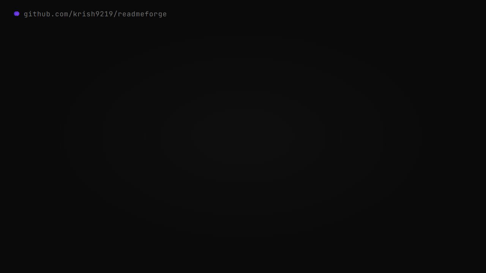
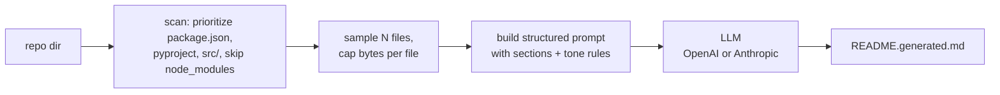

# readmeforge

> *Generate a polished README from any repo in one command.*



<p align="left">
  <a href="https://github.com/krish9219/readmeforge/stargazers"></a>
  <a href="https://www.npmjs.com/package/readmeforge"></a>
  <a href="https://github.com/krish9219/readmeforge/blob/main/LICENSE"></a>
  
  
  <a href="https://github.com/krish9219/readmeforge/actions"></a>
</p>

`readmeforge` walks your repo, samples the files that actually matter (`package.json`, `pyproject.toml`, source files — never `node_modules` or images), builds a structured prompt, and asks an LLM to write the kind of README that wins a star in 8 seconds. No interactive wizard, no template that ignores your code. One command.

```bash
npx readmeforge ./my-repo --out README.md
```

That's the whole pitch.

## How it works



Four stages: scan → sample → prompt → generate. The prompt isn't generic — it explicitly tells the model which sections to write, what tone to avoid, and bans words like *robust*, *blazing*, *seamless*.

## Quick start

```bash
# Run without installing
npx readmeforge .

# Install globally
npm install -g readmeforge
readmeforge ~/code/my-project --out README.md

# Preview without writing a file
readmeforge . --stdout

# Use Claude instead of GPT
readmeforge . --provider anthropic --model claude-haiku-4-5-20251001

# Inspect the exact prompt that will be sent
readmeforge . --dry-run
```

Set one env var depending on the provider:

```bash
export OPENAI_API_KEY=sk-...           # default
export ANTHROPIC_API_KEY=sk-ant-...    # with --provider anthropic
```

## Example

Pointed at `rag-in-100-lines` it produces a README like:

```markdown
# rag-in-100-lines

> *A complete Retrieval-Augmented Generation engine in one Python file.*

Most RAG tutorials reach for LangChain before retrieving a single chunk.
The actual algorithm is small. This repo is the algorithm, end-to-end,
in 100 readable lines.

## Quick start
...
```

You then edit it. The point of `readmeforge` is not the final word — it's the first 80% so you can spend your time on the last 20%.

## Features

- **Smart scanning** — prioritizes `package.json`, `pyproject.toml`, `README`, then `src/`, then everything else; skips `node_modules`, `.git`, binary files, lockfiles, and giant blobs.
- **Token-aware** — caps per-file bytes and total files so you don't blow the model's context window on a monorepo.
- **Two providers** — OpenAI (default) and Anthropic Claude. Easy to add more.
- **Zero magic config** — every knob (model, file caps, output path) is a CLI flag.
- **Safe by default** — won't overwrite an existing README without `--force`.
- **Dry run** — `--dry-run` prints the prompt without calling the API. Useful for debugging and offline review of what's being sent.

## All flags

```
Usage: readmeforge [options] [dir]

Arguments:
  dir                      repo directory (default: ".")

Options:
  -p, --provider <name>    openai | anthropic (default: "openai")
  -m, --model <name>       model id (defaults per provider)
  -o, --out <path>         output file (default: "README.generated.md")
  -f, --force              overwrite existing output file
  --stdout                 print to stdout instead of writing a file
  --max-files <n>          max files to include in the prompt (default: 40)
  --max-bytes <n>          max bytes per file in the prompt (default: 4000)
  --dry-run                scan + build prompt but don't call the LLM
  -h, --help               display help
```

## vs. the alternatives

| | readmeforge | readme-ai | gpt-readme | hand-written |
|---|---|---|---|---|
| **Install size** | <2 MB | ~100 MB (heavy deps) | varies | 0 |
| **Two-provider support** | yes | no | no | n/a |
| **Reads your code (not just package.json)** | yes | yes | partial | yes |
| **Prompt is auditable (`--dry-run`)** | yes | no | no | n/a |
| **Time to first output** | seconds | ~30s install + run | varies | hours |
| **Style bans** ("robust", "blazing") | yes | no | no | depends |

## FAQ

**Why not just paste my repo into ChatGPT?** You can, and it'll work for tiny repos. `readmeforge` automates the boring part: picking which files are relevant, budgeting the prompt, and applying a tuned system prompt every time.

**Will it overwrite my README?** No. Default output is `README.generated.md`. To overwrite, pass `--force` and `--out README.md`.

**Token cost?** A 40-file × 4 KB scan is ~40k tokens of input + ~1.5k of output. With `gpt-4o-mini` that's pennies per run.

**Does it work on private code?** It sends your file contents to whichever provider you configure. If your code is sensitive, point it at a local Ollama-compatible endpoint by editing `src/providers.js` — about 20 lines of changes.

**Can I customize the prompt?** Yes — edit `src/prompt.js`. The prompt is intentionally hand-written so you can read and modify it without digging into a templating engine.

## Tests

```bash
npm test
```

Unit tests cover scanning priority, node_modules / binary exclusion, and prompt assembly. They run without an API key.

## Contributing

See [CONTRIBUTING.md](CONTRIBUTING.md). Security: see [SECURITY.md](SECURITY.md).

## Star history

[](https://star-history.com/#krish9219/readmeforge&Date)

## License

MIT — see [LICENSE](LICENSE).
